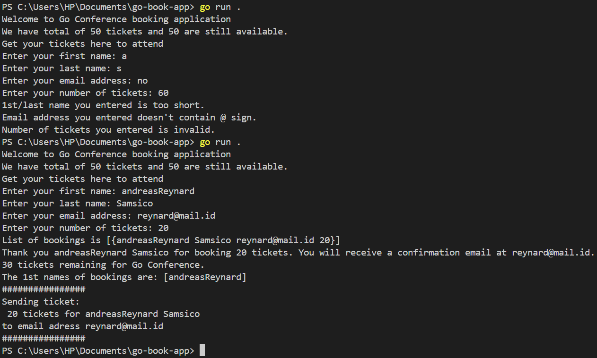

Gambar ini adalah terminal yang menunjukan keberhasilan pengunaan kerangka kerja GO (bagian 1). Berikut adalah fitur-fitur di kode ini:

- Banyak tiket yang tersisa,
- Array berisikan daftar _bookings_, dan
- Permintaan untuk input nama, email, dan banyak tiket yang butuh beserta validasi masing-masing input apakah pantas untuk didaftarkan sebagai peserta.

-- Andreas Reynard Samsico 5025221020 PBKK D
